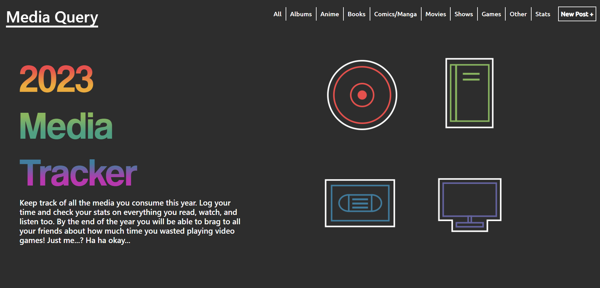

# media-tracker

This project was another MERN stack exercise drivin by my tendancy to track my media consumption. 

## Check out the Project

Check out the different aspects of the project below:

- [Heroku Deployment](https://jm-media-tracker.herokuapp.com/)
- [Repository](https://github.com/johnathanmann/media-tracker)

# Resources

Some stuff I referenced/used while making this site
[CanvasJs](https://canvasjs.com/ )
[CSS Floating Element](https://www.geeksforgeeks.org/css-floating-animation/)
[Tooltip](https://jsfiddle.net/w0wtkgpu/3/)
[Tooltip](http://jsfiddle.net/abhitalks/aRzA3/1/)
[Filtering an Array](https://stackoverflow.com/questions/33364851/filter-json-data-based-on-certain-properties-and-values)

 